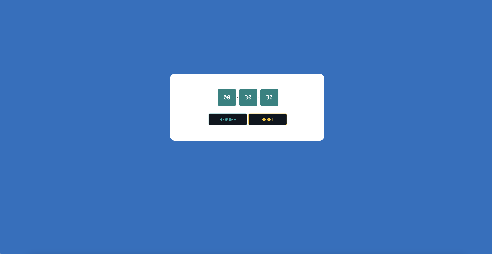

## This repo is for a stopwatch app 

Page is published at [https://masoudsoleymani.github.io/stopwatch/](https://masoudsoleymani.github.io/stopwatch/)

## Run in the development mode

  ### Prerequisites
  - [Node.js](https://nodejs.org/en/)
  - [yarn](https://classic.yarnpkg.com/en/docs/install/)
  - [Docker](https://www.docker.com/)

  ### Installation
  - clone the repo
  - `yarn` for dependencies installation

  ### Running
  - `yarn start` for webpack-dev-server
  - `yarn build` for production

  ### Running with Docker
  * Build: `docker build -t stopwatch .`
  * Run: `docker run -it -p 3000:3000 stopwatch`
  * Open [http://localhost:3000](http://localhost:3000)

## Screen

